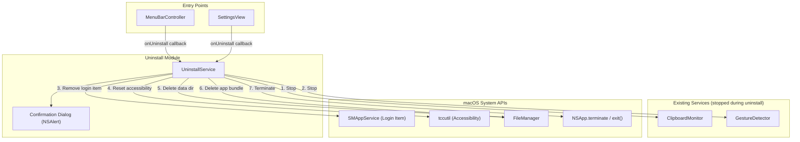
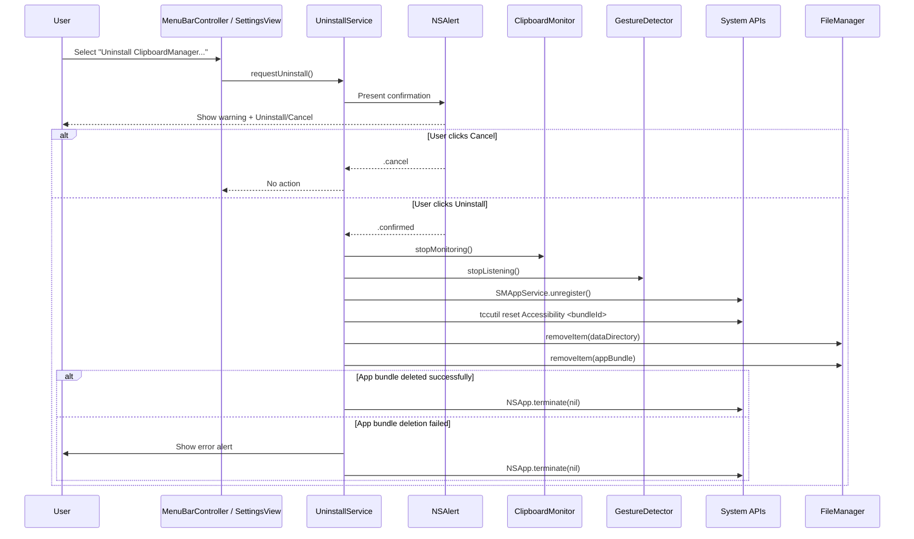

# Design Document: App Uninstaller

## Overview

The App Uninstaller adds complete self-removal capability to the ClipboardManager macOS menu bar app. When triggered, it performs a sequential cleanup pipeline: stops active services, deregisters system integrations (login item, accessibility permissions), deletes all user data, removes the app bundle from disk, and terminates the process.

The uninstaller is exposed via two entry points (menu bar item and settings button) and requires explicit user confirmation before proceeding. The pipeline is designed for graceful degradation — non-critical step failures are logged and skipped so that the removal completes as fully as possible.

### Key Design Decisions

| Decision | Rationale |
|----------|-----------|
| Sequential pipeline with per-step timeouts | Ensures the app remains running long enough to complete all cleanup; prevents indefinite hangs on system API calls |
| Continue-on-failure for non-critical steps | Login item and accessibility removal may fail due to SIP or missing entries; these should not block data/app deletion |
| Direct file deletion (not Trash) | Requirement specifies permanent removal; Trash would leave recoverable traces |
| Shell-out to `tccutil` for accessibility reset | No public Swift API exists to modify the TCC database; `tccutil reset` is the Apple-sanctioned approach |
| `SMAppService` for login item removal | macOS 13+ API for managing login items in non-sandboxed apps; replaces deprecated `SMLoginItemSetEnabled` |
| Single `UninstallService` class | Centralizes the pipeline logic with protocol-based dependencies for testability |
| `NSAlert` for confirmation dialog | Native macOS modal alert with destructive button styling; works from both menu bar and settings contexts |

## Architecture



### Uninstall Flow



## Components and Interfaces

### UninstallService

The central orchestrator for the uninstall pipeline. Owns the sequential execution logic, timeout enforcement, and error handling.

```swift
/// Protocol for dependency injection and testing.
protocol Uninstalling {
    func requestUninstall()
}

/// Orchestrates the complete app self-removal pipeline.
@MainActor
final class UninstallService: Uninstalling {

    // MARK: - Dependencies (injected for testability)

    private let clipboardMonitor: ClipboardMonitoring
    private let gestureDetector: GestureDetecting
    private let fileManager: FileManager
    private let bundleIdentifier: String
    private let appBundleURL: URL
    private let dataDirectoryURL: URL

    // MARK: - State

    private var isDialogPresented: Bool = false

    // MARK: - Callbacks

    /// Called to present error messages to the user.
    var onError: ((String) -> Void)?

    // MARK: - Public API

    /// Entry point from menu bar or settings. Shows confirmation dialog
    /// or brings existing dialog to focus if already presented.
    func requestUninstall()

    // MARK: - Pipeline Steps (internal for testing)

    /// Presents the confirmation NSAlert. Returns true if user confirmed.
    func presentConfirmationDialog() -> Bool

    /// Stops clipboard monitoring.
    func stopMonitoring()

    /// Stops gesture detection.
    func stopGestureDetection()

    /// Removes the login item registration via SMAppService.
    func removeLoginItem()

    /// Resets accessibility permissions via tccutil.
    func resetAccessibilityPermissions()

    /// Deletes all contents of the data directory, then the directory itself.
    func deleteDataDirectory()

    /// Deletes the app bundle from disk. Returns true if successful.
    func deleteAppBundle() -> Bool

    /// Terminates the process. Force-terminates after 5 seconds if needed.
    func terminateApp()
}
```

### UninstallService Integration with AppDelegate

The `UninstallService` is created in `AppDelegate` during service initialization and wired to both entry points:

```swift
// In AppDelegate.initializeServices():
uninstallService = UninstallService(
    clipboardMonitor: clipboardMonitor,
    gestureDetector: gestureDetector,
    fileManager: .default,
    bundleIdentifier: Bundle.main.bundleIdentifier ?? "com.clipboardmanager",
    appBundleURL: Bundle.main.bundleURL,
    dataDirectoryURL: persistenceService.directoryURL
)

// Wire to MenuBarController:
menuBarController.onUninstall = { [weak self] in
    self?.uninstallService.requestUninstall()
}

// Pass to SettingsView for the button:
let settingsView = SettingsView(
    settingsManager: settingsManager,
    onUninstall: { [weak self] in
        self?.uninstallService.requestUninstall()
    }
)
```

### MenuBarController Changes

Add an "Uninstall ClipboardManager..." menu item with separator, positioned immediately before the existing "Quit" item:

```swift
// New callback
var onUninstall: (() -> Void)?

// In setupMenuBar(), before the Quit item:
menu.addItem(.separator())  // Separator before uninstall

let uninstallItem = NSMenuItem(
    title: "Uninstall ClipboardManager...",
    action: #selector(uninstallAction(_:)),
    keyEquivalent: ""
)
uninstallItem.target = self
menu.addItem(uninstallItem)

// Existing quit item follows immediately after
let quitItem = NSMenuItem(...)
menu.addItem(quitItem)
```

### SettingsView Changes

Add an "Uninstall ClipboardManager..." button in the existing About section:

```swift
// New property
let onUninstall: () -> Void

// In aboutSection, add after the Reset button:
Button(role: .destructive) {
    onUninstall()
} label: {
    Text("Uninstall ClipboardManager...")
}
```

### Confirmation Dialog

Implemented as an `NSAlert` presented on the main thread:

```swift
func presentConfirmationDialog() -> Bool {
    guard !isDialogPresented else {
        // Bring existing dialog window to front
        NSApp.activate(ignoringOtherApps: true)
        return false
    }

    isDialogPresented = true

    let alert = NSAlert()
    alert.messageText = "Uninstall ClipboardManager"
    alert.informativeText = "This will permanently remove ClipboardManager and all its data. Are you sure?"
    alert.alertStyle = .critical

    // Destructive "Uninstall" button
    let uninstallButton = alert.addButton(withTitle: "Uninstall")
    uninstallButton.hasDestructiveAction = true

    // Default "Cancel" button
    alert.addButton(withTitle: "Cancel")

    let response = alert.runModal()
    isDialogPresented = false

    return response == .alertFirstButtonReturn
}
```

## Data Models

### UninstallStep (for logging and sequencing)

```swift
/// Represents each discrete step in the uninstall pipeline.
enum UninstallStep: String, CaseIterable {
    case stopMonitoring = "Stop Clipboard Monitoring"
    case stopGestureDetection = "Stop Gesture Detection"
    case removeLoginItem = "Remove Login Item"
    case resetAccessibility = "Reset Accessibility Permissions"
    case deleteDataDirectory = "Delete Data Directory"
    case deleteAppBundle = "Delete App Bundle"
    case terminateProcess = "Terminate Process"
}
```

### UninstallStepResult (for pipeline reporting)

```swift
/// The outcome of each uninstall step.
enum UninstallStepResult {
    case success
    case skipped(reason: String)
    case failed(error: Error)
    case timedOut
}
```

### UninstallLog (internal diagnostic record)

```swift
/// A record of each step's execution for diagnostics/logging.
struct UninstallLog {
    let step: UninstallStep
    let result: UninstallStepResult
    let duration: TimeInterval
}
```

### File System Paths

```
~/Library/Application Support/ClipboardManager/   ← Data_Directory (deleted)
├── history.json                                   ← History_File (deleted)
├── settings.json                                  ← Settings_File (deleted)
└── (any other files/subdirectories)               ← All deleted

/Applications/ClipboardManager.app/               ← App_Bundle (deleted)
└── Contents/
    ├── MacOS/ClipboardManager
    ├── Resources/
    └── Info.plist
```

## Correctness Properties

*A property is a characteristic or behavior that should hold true across all valid executions of a system—essentially, a formal statement about what the system should do. Properties serve as the bridge between human-readable specifications and machine-verifiable correctness guarantees.*

### Property 1: Sequential operation order

*For any* uninstall execution, regardless of which steps succeed or fail, the pipeline SHALL invoke operations in exactly this order: stop monitoring, stop gesture detection, remove login item, reset accessibility, delete data directory, delete app bundle, terminate process. No step SHALL be invoked before the preceding step has completed or timed out.

**Validates: Requirements 9.1, 9.2**

### Property 2: Error resilience for non-critical steps

*For any* combination of failures in the steps preceding app bundle deletion (stop monitoring, stop gesture detection, login item removal, accessibility reset, data directory deletion), the uninstaller SHALL still attempt all subsequent steps in the pipeline. Only app bundle deletion failure triggers user-visible error reporting.

**Validates: Requirements 4.2, 5.2, 5.3, 6.5, 6.7, 9.3**

### Property 3: Data directory complete cleanup

*For any* set of files and subdirectories within the data directory, the uninstaller SHALL attempt to delete every file and subdirectory individually. After all individual deletions are attempted, the uninstaller SHALL attempt to delete the data directory itself, regardless of whether any individual file deletions failed.

**Validates: Requirements 6.3, 6.4, 6.5**

### Property 4: No file creation during uninstall

*For any* uninstall execution, the uninstaller SHALL NOT create any new files, backup files, export files, or copies of user data at any filesystem location during the uninstall process.

**Validates: Requirements 10.3**

## Error Handling

### Pipeline Error Strategy

The uninstall pipeline uses a "best effort" approach — each step is attempted regardless of prior failures, with the sole exception of app bundle deletion failure which triggers user notification.

| Step | Failure Behavior | User Notification |
|------|-----------------|-------------------|
| Stop monitoring | Log, continue | None |
| Stop gesture detection | Log, continue | None |
| Remove login item | Log, continue | None |
| Reset accessibility | Log, continue | None |
| Delete data directory files | Log each failure, continue with remaining | None |
| Delete data directory itself | Log, continue | None |
| Delete app bundle | Log, show error alert | Display path that failed |
| Terminate process | Force-kill after 5s | None |

### Timeout Handling

Each step has a maximum execution time of 10 seconds (5 seconds for login item specifically). If exceeded:
1. The step is marked as timed out in the log
2. The pipeline proceeds to the next step
3. No error is shown to the user for timed-out non-critical steps

### Specific Error Scenarios

| Scenario | Handling |
|----------|----------|
| Login item doesn't exist | `SMAppService.unregister()` returns success or specific error; log and continue |
| `tccutil` not found or fails | Process returns non-zero exit code; log stderr and continue |
| Data directory doesn't exist | `FileManager.fileExists` returns false; skip data deletion entirely |
| App bundle path is nil | Use `Bundle.main.bundleURL`; if unavailable, skip bundle deletion and log error |
| Permission denied on app bundle | Show error to user with the specific path; terminate anyway |
| Partial app bundle deletion | Leave remaining files in place; show partial removal error; terminate |
| `NSApp.terminate` doesn't exit | After 5 seconds, call `exit(0)` to force-terminate |

### Logging

All steps log to `os.Logger` with subsystem `"com.clipboardmanager"` and category `"UninstallService"`:
- `.info` for successful step completion
- `.warning` for skipped steps (entry doesn't exist)
- `.error` for failed steps with error details

## Testing Strategy

### Unit Tests

Focus on specific examples, edge cases, and component interactions:

- **UninstallService pipeline**: Verify each step is called, verify continue-on-failure behavior for specific error types
- **Confirmation dialog**: Verify message text, button titles, button roles, escape behavior, single-instance guard
- **MenuBarController integration**: Verify menu item exists at correct position (before Quit, after separator)
- **SettingsView integration**: Verify uninstall button exists in About section
- **Login item removal**: Verify `SMAppService` API is called with correct identifier
- **Accessibility reset**: Verify `tccutil reset Accessibility <bundleId>` command is constructed correctly
- **Data directory deletion**: Verify all files enumerated and deleted, directory deleted last
- **App bundle deletion**: Verify direct deletion (not trash), verification check after deletion
- **Termination**: Verify terminate is called after all deletions, force-terminate after timeout
- **Timeout behavior**: Verify steps that exceed timeout are interrupted and pipeline continues

### Property-Based Tests

Property-based testing library: [swift-testing](https://github.com/apple/swift-testing) with custom generators.

Configuration:
- Minimum 100 iterations per property test
- Each test tagged with property reference comment

Properties to implement:

| Property | Test Focus | Key Generator |
|----------|-----------|---------------|
| 1: Sequential order | Pipeline step invocation ordering | Random step success/failure/timeout combinations |
| 2: Error resilience | Pipeline continuation on failures | Random subsets of steps that fail, with random error types |
| 3: Data directory cleanup | File enumeration and deletion completeness | Random directory structures (varying file counts, nesting, failure sets) |
| 4: No file creation | Filesystem write monitoring | Random pipeline execution states |

Tag format for each test:
```swift
// Feature: app-uninstaller, Property 1: Sequential operation order
```

### Integration Tests

- **Full uninstall pipeline** (with mocked system APIs): Run complete pipeline, verify all steps execute in order
- **Confirmation dialog presentation**: Verify NSAlert appears and responds correctly
- **Menu bar item**: Verify item appears in correct position and triggers callback
- **Settings button**: Verify button triggers callback
- **tccutil interaction**: Verify Process is launched with correct arguments (mocked)

### Test Infrastructure

- Protocol-based dependency injection for `FileManager`, `ProcessLauncher` (for tccutil), and `SMAppService`
- Mock implementations for all system API interactions
- Use `@testable import ClipboardManager` for internal access to pipeline step methods
- Spy pattern to record step invocation order for Property 1
