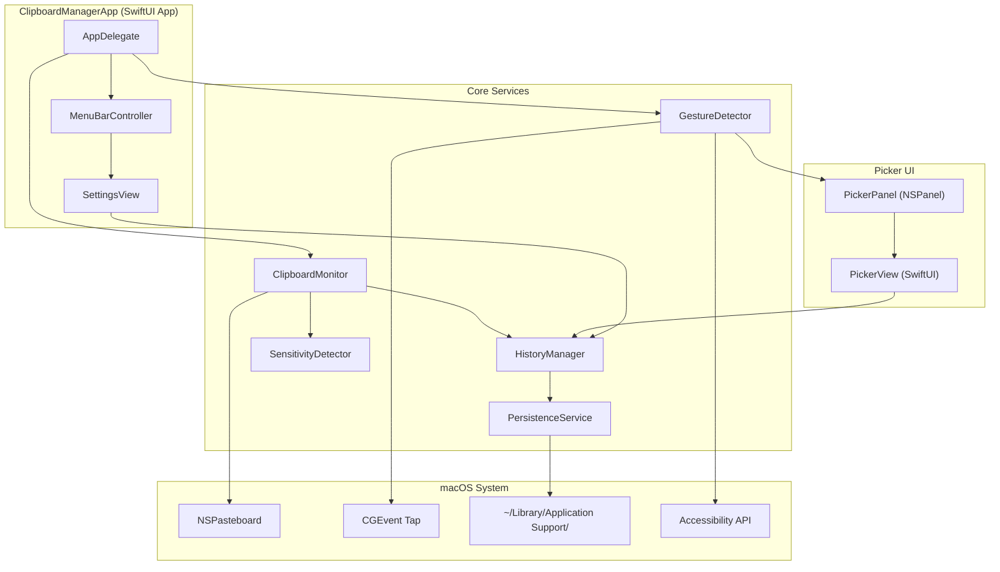
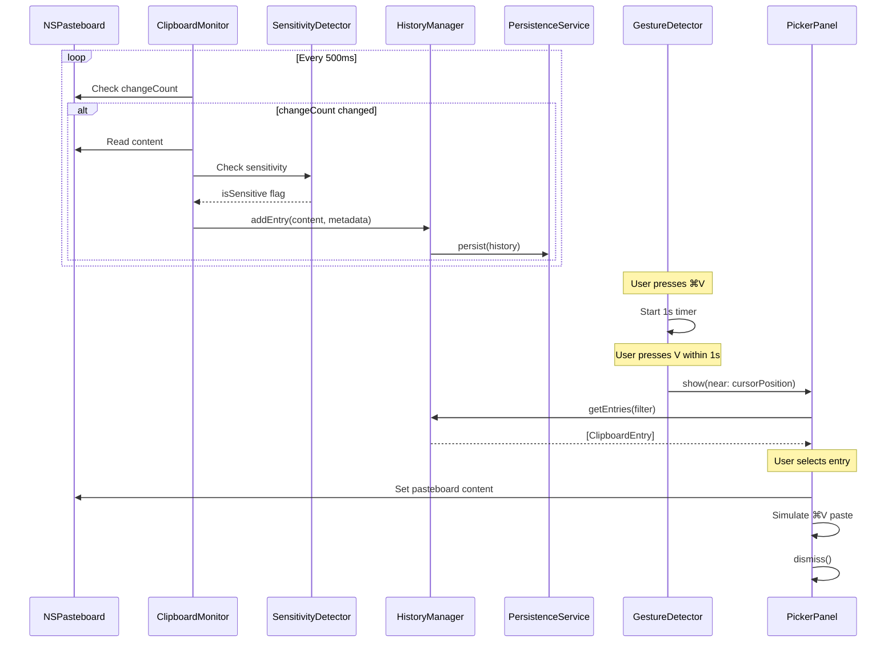

# Design Document: macOS Clipboard Manager

## Overview

The macOS Clipboard Manager is a native Swift/SwiftUI menu bar application that extends the system clipboard with persistent history. It monitors clipboard changes via polling `NSPasteboard.changeCount`, stores entries in a JSON file, and surfaces history through a floating picker panel triggered by a rapid ⌘V+V gesture (detected via Accessibility API / CGEvent tap).

The app targets macOS Sequoia 15+ and is distributed locally (no App Store sandboxing). It requires Accessibility permissions for key event interception.

### Key Design Decisions

| Decision | Rationale |
|----------|-----------|
| Polling at 500ms vs. notification-based | `NSPasteboard` has no change notification API; polling `changeCount` is the idiomatic macOS approach |
| CGEvent tap for gesture detection | Only reliable way to intercept system-wide keystrokes; requires Accessibility permissions |
| JSON file persistence | Simple, human-readable, sufficient for ≤150 entries at ≤50 MB each; avoids Core Data overhead |
| Floating NSPanel for picker | `NSPanel` with `.nonactivatingPanel` style avoids stealing focus from the active app |
| Menu bar app (LSUIElement) | No dock icon; lifecycle tied to login item; unobtrusive UX |

## Architecture



### Data Flow



## Components and Interfaces

### ClipboardMonitor

Responsible for polling the system pasteboard and detecting new clipboard content.

```swift
protocol ClipboardMonitoring {
    var isMonitoring: Bool { get }
    func startMonitoring()
    func stopMonitoring()
}

class ClipboardMonitor: ClipboardMonitoring, ObservableObject {
    @Published var isMonitoring: Bool = false

    private let pasteboard: NSPasteboard
    private let pollInterval: TimeInterval = 0.5
    private var lastChangeCount: Int
    private var timer: Timer?
    private let historyManager: HistoryManaging
    private let sensitivityDetector: SensitivityDetecting
    private let settingsManager: SettingsManaging

    func startMonitoring()
    func stopMonitoring()

    // Internal
    private func pollClipboard()
    private func captureContent() -> ClipboardContent?
    private func shouldCapture(from sourceApp: String?) -> Bool
    private func isDuplicate(_ content: ClipboardContent) -> Bool
    private func exceedsMaxSize(_ content: ClipboardContent) -> Bool
}
```

### GestureDetector

Intercepts system-wide key events to detect the ⌘V+V trigger gesture.

```swift
protocol GestureDetecting {
    var isEnabled: Bool { get }
    func startListening()
    func stopListening()
}

class GestureDetector: GestureDetecting {
    private var eventTap: CFMachPort?
    private var lastCmdVTime: Date?
    private let triggerWindow: TimeInterval = 1.0
    private let onTrigger: (CGPoint) -> Void

    func startListening()
    func stopListening()

    // CGEvent callback
    private func handleKeyEvent(_ event: CGEvent) -> CGEvent?
    private func getCursorPosition() -> CGPoint
    private func getCaretPosition() -> CGPoint?
}
```

### HistoryManager

Manages the in-memory clipboard history, deduplication, and ordering.

```swift
protocol HistoryManaging {
    var entries: [ClipboardEntry] { get }
    var maxEntries: Int { get set }

    func addEntry(_ content: ClipboardContent, isSensitive: Bool) -> ClipboardEntry
    func deleteEntry(id: UUID) -> Bool
    func clearAll()
    func filteredEntries(matching query: String) -> [ClipboardEntry]
    func markSensitive(id: UUID, sensitive: Bool)
    func moveToTop(id: UUID)
}

class HistoryManager: HistoryManaging, ObservableObject {
    @Published private(set) var entries: [ClipboardEntry] = []
    var maxEntries: Int

    private let persistenceService: PersistenceServicing

    func addEntry(_ content: ClipboardContent, isSensitive: Bool) -> ClipboardEntry
    func deleteEntry(id: UUID) -> Bool
    func clearAll()
    func filteredEntries(matching query: String) -> [ClipboardEntry]
    func markSensitive(id: UUID, sensitive: Bool)
    func moveToTop(id: UUID)
}
```

### PersistenceService

Handles atomic JSON file read/write operations.

```swift
protocol PersistenceServicing {
    func loadHistory() throws -> [ClipboardEntry]
    func saveHistory(_ entries: [ClipboardEntry]) throws
    func loadSettings() throws -> AppSettings
    func saveSettings(_ settings: AppSettings) throws
}

class PersistenceService: PersistenceServicing {
    private let historyFileURL: URL
    private let settingsFileURL: URL
    private let fileManager: FileManager
    private let encoder: JSONEncoder
    private let decoder: JSONDecoder

    func loadHistory() throws -> [ClipboardEntry]
    func saveHistory(_ entries: [ClipboardEntry]) throws  // atomic write via temp file
    func loadSettings() throws -> AppSettings
    func saveSettings(_ settings: AppSettings) throws
}
```

### SensitivityDetector

Identifies sensitive clipboard content from password managers or concealed types.

```swift
protocol SensitivityDetecting {
    func isSensitive(sourceApp: String?, pasteboardTypes: [NSPasteboard.PasteboardType]) -> Bool
}

class SensitivityDetector: SensitivityDetecting {
    private let knownPasswordManagers: Set<String>

    func isSensitive(sourceApp: String?, pasteboardTypes: [NSPasteboard.PasteboardType]) -> Bool
}
```

### PickerPanel

The floating NSPanel that hosts the SwiftUI picker view.

```swift
class PickerPanel: NSPanel {
    private let pickerView: NSHostingView<PickerView>

    func show(near position: CGPoint)
    func dismiss()

    // Overrides
    override var canBecomeKey: Bool { true }
    override func resignKey() { dismiss() }
}
```

### PickerView (SwiftUI)

```swift
struct PickerView: View {
    @ObservedObject var viewModel: PickerViewModel
    @State private var searchText: String = ""
    @State private var selectedIndex: Int = 0

    var body: some View { ... }
}

class PickerViewModel: ObservableObject {
    @Published var displayedEntries: [ClipboardEntry] = []
    @Published var selectedIndex: Int = 0

    private let historyManager: HistoryManaging
    private let onSelect: (ClipboardEntry) -> Void
    private let onDismiss: () -> Void

    func filter(query: String)
    func selectEntry(at index: Int)
    func moveSelection(direction: Direction)
    func confirmSelection()
    func dismiss()
}
```

### MenuBarController

```swift
class MenuBarController {
    private var statusItem: NSStatusItem
    private var menu: NSMenu

    func setupMenuBar()
    func updateIcon(isEnabled: Bool)
    func showMenu()
}
```

### SettingsManager

```swift
protocol SettingsManaging {
    var settings: AppSettings { get }
    func updateHistorySize(_ size: Int)
    func updateContentTypes(_ types: CaptureContentTypes)
    func addExcludedApp(_ bundleId: String)
    func removeExcludedApp(_ bundleId: String)
    func updateTriggerGesture(_ gesture: KeyGesture)
    func updateTheme(_ theme: ThemePreference)
    func updateAutoStart(_ enabled: Bool)
    func updateMonitoringEnabled(_ enabled: Bool)
}
```

## Data Models

```swift
// MARK: - Clipboard Entry

struct ClipboardEntry: Codable, Identifiable, Equatable {
    let id: UUID
    var capturedAt: Date
    let content: ClipboardContent
    var isSensitive: Bool
    let sourceAppBundleId: String?
}

// MARK: - Clipboard Content

enum ClipboardContent: Codable, Equatable {
    case plainText(String)
    case richText(data: Data, plainFallback: String)
    case image(data: Data, dimensions: ImageDimensions)
    case file(url: URL, fileName: String)

    var plainTextPreview: String { ... }
    var contentType: ContentType { ... }
    var byteSize: Int { ... }
}

enum ContentType: String, Codable {
    case plainText
    case richText
    case image
    case file
}

struct ImageDimensions: Codable, Equatable {
    let width: Int
    let height: Int
}

// MARK: - App Settings

struct AppSettings: Codable, Equatable {
    var historySize: Int = 100          // 1...150
    var captureContentTypes: CaptureContentTypes = .init()
    var excludedApps: [String] = []     // Bundle identifiers
    var triggerGesture: KeyGesture = .default
    var theme: ThemePreference = .system
    var autoStartAtLogin: Bool = false
    var monitoringEnabled: Bool = true
}

struct CaptureContentTypes: Codable, Equatable {
    var plainText: Bool = true          // Always true, not user-configurable
    var richText: Bool = true
    var images: Bool = true
    var files: Bool = true
}

struct KeyGesture: Codable, Equatable {
    let modifiers: NSEvent.ModifierFlags
    let keyCode: UInt16

    static let `default` = KeyGesture(
        modifiers: .command,
        keyCode: 0x09 // V key
    )
}

enum ThemePreference: String, Codable {
    case light
    case dark
    case system
}

// MARK: - Persistence File Structure

struct HistoryFile: Codable {
    let version: Int
    let entries: [ClipboardEntry]
}
```

### File System Layout

```
~/Library/Application Support/ClipboardManager/
├── history.json          # Clipboard history entries
├── settings.json         # User preferences
└── history.json.tmp      # Temporary file during atomic writes
```

## Correctness Properties

*A property is a characteristic or behavior that should hold true across all valid executions of a system—essentially, a formal statement about what the system should do. Properties serve as the bridge between human-readable specifications and machine-verifiable correctness guarantees.*

### Property 1: Disabled state blocks all activity

*For any* clipboard content change and any key gesture sequence, when the Menu_Bar_Toggle is disabled, the clipboard history SHALL remain unchanged and the Picker SHALL not open.

**Validates: Requirements 1.3, 2.4, 8.3**

### Property 2: Excluded apps produce no entries

*For any* clipboard content originating from an application whose bundle identifier is in the Excluded_App list, the History_Store SHALL not contain a new entry for that content.

**Validates: Requirements 1.4**

### Property 3: No consecutive duplicate entries

*For any* clipboard content that is byte-identical to the most recent entry in the History_Store with the same content type, attempting to add it SHALL NOT create a new entry (the history length remains unchanged).

**Validates: Requirements 1.10**

### Property 4: Oversized content is discarded

*For any* clipboard content whose byte size exceeds 50 MB, attempting to capture it SHALL NOT create a new entry in the History_Store.

**Validates: Requirements 1.11**

### Property 5: Gesture timing window

*For any* pair of keystrokes (⌘V followed by V), the Picker SHALL open if and only if the time interval between them is less than 1 second. If the interval is ≥ 1 second, no Picker action SHALL occur.

**Validates: Requirements 2.2, 2.3**

### Property 6: History ordering invariant

*For any* sequence of add, deduplicate, or delete operations on the History_Store, the entries SHALL always be ordered by descending `capturedAt` timestamp (most recent first).

**Validates: Requirements 3.3, 5.1**

### Property 7: Preview truncation

*For any* ClipboardEntry with plain text content, the displayed preview string SHALL have length ≤ 83 characters (80 + "..." ellipsis), and SHALL equal the first 80 characters of the content followed by "..." if the content exceeds 80 characters, or the full content otherwise.

**Validates: Requirements 3.4**

### Property 8: Sensitive entry masking is fixed-length and content-independent

*For any* Sensitive_Entry regardless of its actual content length, the displayed mask SHALL be a fixed-length string of uniform characters that does not reveal the actual content or its length.

**Validates: Requirements 3.5, 7.4**

### Property 9: Navigation stays in bounds

*For any* list of N displayed entries (N ≥ 1) and any sequence of up/down arrow key presses, the selection index SHALL always remain in the range [0, N-1] without wrapping.

**Validates: Requirements 4.2, 4.3**

### Property 10: Search filter correctness

*For any* search query string and any set of ClipboardEntry items, the filtered results SHALL contain exactly those entries whose plain text preview contains the query as a case-insensitive substring, and no others.

**Validates: Requirements 4.10**

### Property 11: Deduplication moves to top with updated timestamp

*For any* History_Store state and new clipboard content that is byte-identical to an existing entry, after capture the History_Store SHALL contain exactly one entry with that content, positioned at index 0, with its `capturedAt` updated to the current time, and the total entry count SHALL not increase.

**Validates: Requirements 5.2**

### Property 12: History size invariant

*For any* sequence of add operations and any configured `maxEntries` value in [1, 150], the History_Store entry count SHALL never exceed `maxEntries`. When at capacity, the oldest entry (last in the list) is evicted.

**Validates: Requirements 5.3, 5.4**

### Property 13: Delete removes exactly the target entry

*For any* History_Store containing N entries and any entry ID present in the store, deleting that entry SHALL result in a history of N-1 entries where all entries except the deleted one remain with unchanged content and order.

**Validates: Requirements 5.5**

### Property 14: History serialization round-trip

*For any* valid list of ClipboardEntry items, serializing to JSON and deserializing back SHALL produce an equivalent list with identical content, metadata, and ordering.

**Validates: Requirements 6.1**

### Property 15: Settings serialization round-trip

*For any* valid AppSettings instance, serializing to JSON and deserializing back SHALL produce an equivalent AppSettings with all fields unchanged.

**Validates: Requirements 9.10**

### Property 16: Sensitivity detection from known sources

*For any* clipboard content where the source application bundle ID matches a known password manager OR the pasteboard types include the `concealed` type flag, the resulting ClipboardEntry SHALL have `isSensitive` set to true.

**Validates: Requirements 7.1, 7.2**

### Property 17: Sensitive paste uses actual content

*For any* Sensitive_Entry selected for pasting, the content placed on the system pasteboard SHALL be the actual unmasked content, not the mask characters.

**Validates: Requirements 7.5**

### Property 18: History size configuration bounds

*For any* integer value provided as history size configuration, the system SHALL accept it if and only if it is in the range [1, 150]. Values outside this range SHALL be rejected.

**Validates: Requirements 9.2**

## Error Handling

### File System Errors

| Scenario | Behavior |
|----------|----------|
| History JSON missing on launch | Start with empty history, no error to user |
| History JSON corrupt/invalid | Start with empty history, log error internally |
| Write to history file fails | Retain in-memory state, log error, retry on next capture |
| Settings file corrupt/unreadable | Reset all settings to defaults, continue operation |
| Disk full during write | Retain in-memory state, log error, continue monitoring |

### Pasteboard Errors

| Scenario | Behavior |
|----------|----------|
| Empty pasteboard after changeCount increment | Skip entry creation, continue polling |
| Unreadable pasteboard content | Skip entry creation, continue polling |
| Content exceeds 50 MB | Discard silently, continue polling |
| Pasteboard type not supported by current settings | Skip that content type, capture supported types if available |

### Permission Errors

| Scenario | Behavior |
|----------|----------|
| Accessibility permission not granted | Clipboard monitoring works; gesture detection disabled; show indicator in menu |
| Accessibility permission revoked at runtime | Gesture detection stops; show indicator; clipboard monitoring continues |
| CGEvent tap creation fails | Log error, retry after 5 seconds, max 3 retries, then show indicator |

### Gesture Detection Errors

| Scenario | Behavior |
|----------|----------|
| Cannot determine caret position | Fall back to mouse pointer position for picker placement |
| Cannot determine mouse position | Place picker at center of active screen |
| Paste simulation fails | Log error, close picker, leave clipboard content for manual paste |

### UI Errors

| Scenario | Behavior |
|----------|----------|
| Picker panel fails to display | Log error, do nothing (user can re-trigger) |
| SwiftUI view fails to render | Show fallback minimal list view |

## Testing Strategy

### Unit Tests

Focus on specific examples, edge cases, and component interactions:

- **ClipboardMonitor**: Verify content type filtering based on settings, duplicate detection, size limit enforcement, excluded app filtering
- **GestureDetector**: Verify state machine transitions, timer expiry behavior
- **HistoryManager**: Verify CRUD operations, deduplication logic, ordering maintenance, capacity enforcement
- **PersistenceService**: Verify file creation, atomic write mechanics, corrupt file handling, missing file handling
- **SensitivityDetector**: Verify password manager detection, concealed flag detection, manual marking
- **PickerViewModel**: Verify search filtering, selection navigation, number key mapping
- **SettingsManager**: Verify validation (history size bounds), default values, live reload

### Property-Based Tests

Property-based testing library: [swift-testing](https://github.com/apple/swift-testing) with custom generators, or [SwiftCheck](https://github.com/typelift/SwiftCheck) for QuickCheck-style properties.

Configuration:
- Minimum 100 iterations per property test
- Each test tagged with property reference comment

Properties to implement:

| Property | Test Focus | Key Generator |
|----------|-----------|---------------|
| 1: Disabled blocks all | HistoryManager + GestureDetector | Random content + gesture sequences |
| 2: Excluded apps | ClipboardMonitor filtering | Random bundle IDs + content |
| 3: No consecutive dupes | HistoryManager.addEntry | Random content sequences with repeats |
| 4: Oversized discard | ClipboardMonitor size check | Random data sizes around 50 MB boundary |
| 5: Gesture timing | GestureDetector state machine | Random time intervals (0ms–2000ms) |
| 6: Ordering invariant | HistoryManager operations | Random operation sequences (add/delete/deduplicate) |
| 7: Preview truncation | ClipboardEntry preview | Random strings (0–500 chars) |
| 8: Sensitive masking | PickerViewModel display | Random sensitive entries with varying lengths |
| 9: Navigation bounds | PickerViewModel navigation | Random list sizes + arrow key sequences |
| 10: Search filter | PickerViewModel.filter | Random entries + random query strings |
| 11: Dedup moves to top | HistoryManager.addEntry | Random history states + duplicate content |
| 12: Size invariant | HistoryManager capacity | Random add sequences + random maxEntries |
| 13: Delete target only | HistoryManager.deleteEntry | Random history + random target ID |
| 14: History round-trip | PersistenceService | Random ClipboardEntry arrays |
| 15: Settings round-trip | PersistenceService | Random AppSettings |
| 16: Sensitivity detection | SensitivityDetector | Random source apps + pasteboard types |
| 17: Sensitive paste content | Paste action | Random sensitive entries |
| 18: History size bounds | SettingsManager validation | Random integers |

Tag format for each test:
```swift
// Feature: macos-clipboard-manager, Property 14: History serialization round-trip
```

### Integration Tests

- **Clipboard monitoring end-to-end**: Write to NSPasteboard, verify entry appears in history
- **Atomic file persistence**: Simulate crash during write, verify no corruption
- **Permission detection**: Grant/revoke Accessibility permission, verify app reacts
- **App lifecycle**: Launch → monitor → quit → relaunch → verify history loaded
- **Menu bar interaction**: Toggle enable/disable, verify monitoring state changes

### Test Infrastructure

- Use protocol-based dependency injection for all system interfaces (NSPasteboard, FileManager, CGEvent)
- Mock implementations for unit and property tests
- Real implementations for integration tests
- SwiftUI previews for visual testing of PickerView states

